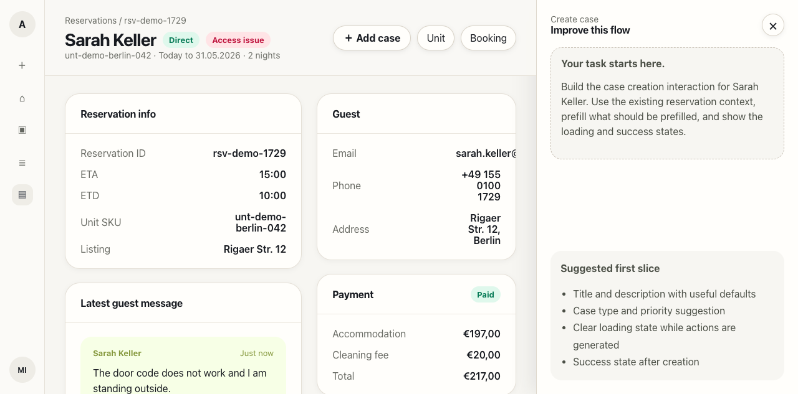

# Product Engineering Case Starter

This is a small starter repo for Arbio's product-engineering case interview. It gives you a working React app with a mocked reservation page and a placeholder create-case panel.

## Goal

Improve the `Create case` interaction for an ops agent who is working from a reservation context.

The starter already includes:

- a reservation page wireframe
- mock reservation, guest, payment, message, and access context
- an `Add case` button
- a placeholder side panel where the create-case flow should live
- plain CSS with no Tailwind setup


## Starter wireframe

The starter app intentionally uses a simple mocked reservation page, not a real Arbio page.



## Setup

```bash
pnpm install
pnpm dev
```

Open the local URL printed by Vite.

## What to build

Create an interaction prototype for the case creation flow. The first slice should show:

1. Reservation context remains visible or recoverable.
2. The create-case surface opens from the `Add case` button.
3. Useful fields are prefilled from the current context.
4. Case type and priority can be suggested or selected.
5. There is a loading state while suggested actions are generated.
6. There is a success state after the case is created.

## What not to build

Do not spend time on:

- real backend calls
- authentication
- real smart-lock lookups
- real task generation logic
- exact Arbio design-system fidelity
- production persistence
- Slack, Booking.com, Airbnb, or Typeform integrations

Mock anything you need.

## Deliverable

At the end of the session, share this repository with your changes and add a short note below.

## Candidate note

Use this section for your short write-up:

1. How to run or open it:
2. What you built:
3. What tradeoffs you made:
4. What you would improve with 2 more hours:
5. What would be needed before shipping this in production:
